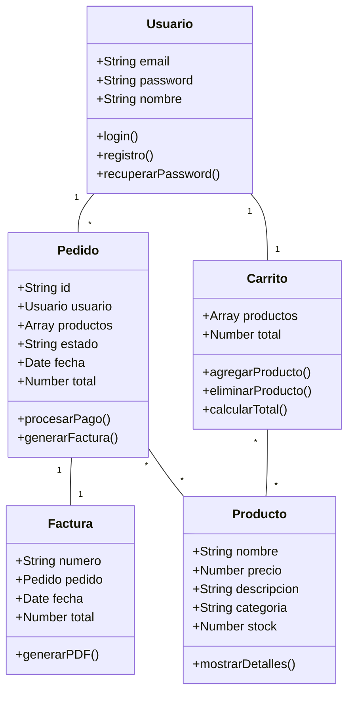
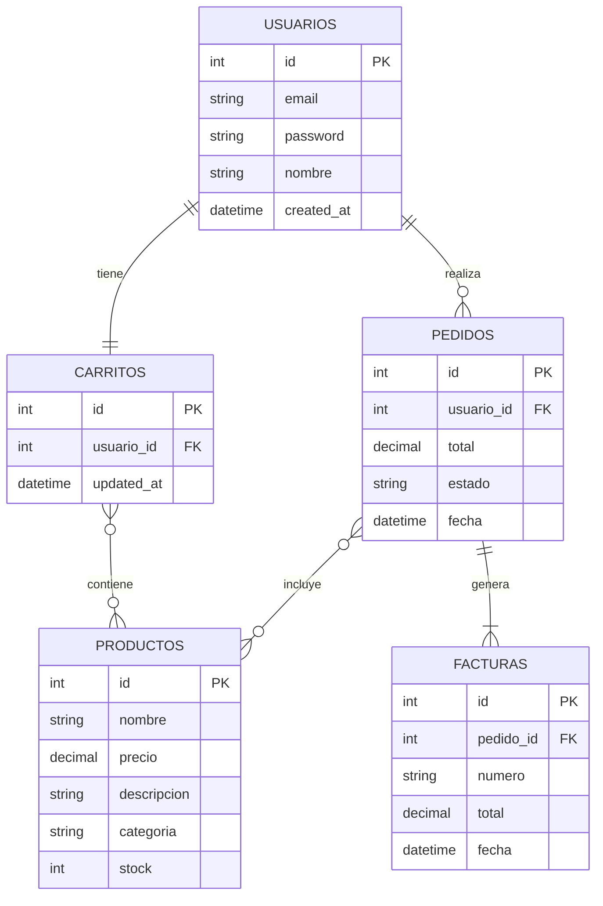

# ModTech - Documentación del Proyecto

## Índice
1. [Índice](#índice)
2. [Agradecimientos/Dedicatoria](#agradecimientosdedicatoria)
3. [Resumen](#resumen)
4. [Abstract](#abstract)
5. [Introducción](#introducción)
6. [Alcance Funcional del Sistema](#alcance-funcional-del-sistema)
7. [Diseño Técnico](#diseño-técnico)
   - [7.1. Diagrama de Clases](#71-diagrama-de-clases)
   - [7.2. Esquema de Bases de Datos](#72-esquema-de-bases-de-datos)
   - [7.3. Diseño de la Interfaz de Usuario](#73-diseño-de-la-interfaz-de-usuario)
8. [Tecnología Utilizada](#tecnología-utilizada)
9. [Planificación y Presupuesto](#planificación-y-presupuesto)
10. [Manual de Instalación](#manual-de-instalación)
11. [Manual de Usuario](#manual-de-usuario)
12. [Conclusiones](#conclusiones)

## Agradecimientos/Dedicatoria

Quiero expresar mi más sincero agradecimiento a todas las personas que han hecho posible este proyecto:

A mi familia, por su apoyo incondicional durante todo el proceso de desarrollo.

A mis profesores del Ciclo Formativo de Grado Superior en Desarrollo de Aplicaciones Web del IES, por su guía y enseñanzas.

A mis compañeros, por su colaboración y feedback constante.

Dedicado especialmente a todos los emprendedores tecnológicos que buscan innovar en el comercio electrónico.

## Resumen

ModTech es una plataforma de comercio electrónico especializada en productos tecnológicos, desarrollada como Trabajo Final del Ciclo Formativo de Grado Superior en Desarrollo de Aplicaciones Web. El proyecto implementa una arquitectura moderna utilizando React y Vite para el frontend, integrada con PayPal para pagos seguros.

La plataforma ofrece una experiencia de compra completa, incluyendo gestión de usuarios, catálogo de productos, carrito de compras, sistema de ofertas y generación automática de facturas. El sistema está diseñado para ser escalable, seguro y fácil de usar.

## Abstract

ModTech is an e-commerce platform specialized in technological products, developed as the Final Project for the Higher Degree in Web Application Development. The project implements a modern architecture using React and Vite for the frontend, integrated with PayPal for secure payments.

The platform offers a complete shopping experience, including user management, product catalog, shopping cart, offers system, and automatic invoice generation. The system is designed to be scalable, secure, and user-friendly.

## Introducción

Este proyecto nace como culminación de mis estudios en el Ciclo Formativo de Grado Superior en Desarrollo de Aplicaciones Web, cursado durante el período 2023-2024. La elección de desarrollar una plataforma de comercio electrónico surge de dos motivaciones principales:

### Motivación Académica
- Aplicar de manera práctica los conocimientos adquiridos durante el ciclo formativo
- Desarrollo frontend con frameworks modernos
- Integración de APIs y servicios externos
- Gestión de bases de datos
- Seguridad web

### Motivación Personal
Mi pasión por la tecnología y experiencia previa en retail me llevaron a identificar la necesidad de una plataforma especializada que combine:
- Experiencia de usuario intuitiva
- Gestión eficiente de productos tecnológicos
- Proceso de compra seguro y transparente

## Alcance Funcional del Sistema

### Para Usuarios No Registrados
- Explorar el catálogo de productos
- Ver detalles de productos y especificaciones técnicas
- Consultar precios y ofertas
- Crear una cuenta nueva

### Para Usuarios Registrados
- Iniciar sesión de forma segura
- Gestionar perfil personal
- Mantener un carrito de compras persistente
- Realizar compras seguras con PayPal
- Acceder al historial de pedidos
- Descargar facturas en PDF
- Recuperar contraseña en caso de olvido

### Gestión de Productos
- Catálogo organizado por categorías
- Sistema de búsqueda avanzada
- Filtros por marca, precio y características
- Sección de ofertas especiales
- Productos destacados
- Información detallada de productos

### Proceso de Compra
- Carrito de compras intuitivo
- Cálculo automático de descuentos
- Integración con PayPal
- Soporte para múltiples monedas (EUR, USD)
- Generación automática de facturas
- Confirmación por email

## Diseño Técnico

### 7.1. Diagrama de Clases



### 7.2. Esquema de Bases de Datos



### 7.3. Diseño de la Interfaz de Usuario

#### Componentes Principales

1. **Barra de Navegación**
   - Logo de la empresa
   - Menú de categorías
   - Buscador
   - Acceso a cuenta/carrito

2. **Página Principal**
   - Slider de ofertas
   - Productos destacados
   - Categorías populares
   - Marcas colaboradoras

3. **Catálogo de Productos**
   - Grid responsivo
   - Filtros laterales
   - Ordenación flexible
   - Vista rápida de productos

4. **Carrito de Compras**
   - Resumen de productos
   - Cálculo de totales
   - Opciones de pago
   - Proceso de checkout

## Tecnología Utilizada

### Frontend
- React 19.0.0
- Vite 6.2.0
- Bootstrap 5.3.3
- TailwindCSS 4.1.3
- PayPal React Components
- Axios para peticiones HTTP

### Backend
- Laravel (API REST)
- MySQL
- JWT para autenticación

### Herramientas de Desarrollo
- Git para control de versiones
- ESLint para calidad de código
- npm para gestión de paquetes

## Planificación y Presupuesto

### Cronograma (Septiembre 2023 - Abril 2024)

#### Fase 1: Análisis y Diseño (Sept-Oct 2023)
- Análisis de requisitos
- Diseño de base de datos
- Diseño de interfaces

#### Fase 2: Desarrollo Base (Nov-Dic 2023)
- Configuración del entorno
- Desarrollo backend básico
- Frontend inicial

#### Fase 3: Desarrollo Avanzado (Ene-Feb 2024)
- Integración de PayPal
- Sistema de usuarios
- Gestión de productos

#### Fase 4: Pruebas y Optimización (Mar-Abr 2024)
- Testing
- Optimización
- Documentación

### Presupuesto

| Concepto | Coste |
|----------|--------|
| Desarrollador Junior (8 meses) | 9.600€ |
| Diseñador UI/UX (tiempo parcial) | 3.200€ |
| Hosting y Dominio | 175€ |
| Certificado SSL | 70€ |
| Formación | 300€ |
| **Total** | **15.009€** |

## Manual de Instalación

### Requisitos Previos
```bash
# Node.js 16 o superior
# npm 8 o superior
# Git
```

### Pasos de Instalación

1. **Clonar el Repositorio**
```bash
git clone [URL_REPOSITORIO]
cd modtech
```

2. **Instalar Dependencias**
```bash
npm install
```

3. **Configurar Variables de Entorno**
```bash
cp .env.example .env
# Editar .env con las credenciales necesarias
```

4. **Iniciar el Proyecto**
```bash
npm run dev
```

## Manual de Usuario

### Registro y Login
1. Acceder a la página principal
2. Hacer clic en "Registrarse"
3. Completar formulario
4. Verificar email
5. Iniciar sesión

### Realizar una Compra
1. Navegar por el catálogo
2. Añadir productos al carrito
3. Revisar el carrito
4. Proceder al checkout
5. Seleccionar método de pago
6. Confirmar compra

### Gestionar Cuenta
1. Acceder a "Mi Cuenta"
2. Actualizar información personal
3. Ver historial de pedidos
4. Descargar facturas

## Conclusiones

El desarrollo de ModTech ha sido una experiencia enriquecedora que ha permitido:

### Aprendizaje Técnico
- Dominio de React y tecnologías modernas
- Integración de sistemas de pago
- Gestión de seguridad web

### Logros Alcanzados
- Plataforma funcional y escalable
- Interfaz intuitiva y moderna
- Sistema de pagos seguro

### Áreas de Mejora Futura
- Implementación de PWA
- Sistema de reseñas
- Panel de administración
- Análisis de datos

### Valor Añadido
- Experiencia en desarrollo full-stack
- Conocimiento de e-commerce
- Gestión de proyectos reales

El proyecto no solo cumple con los requisitos académicos sino que también proporciona una base sólida para futuras mejoras y desarrollo profesional. 